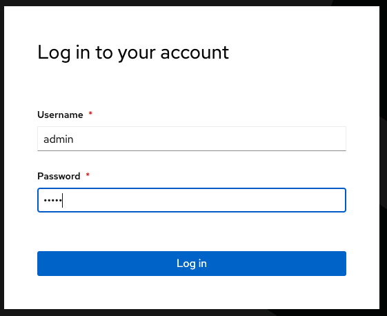
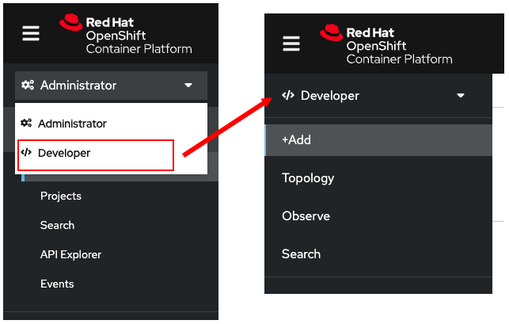
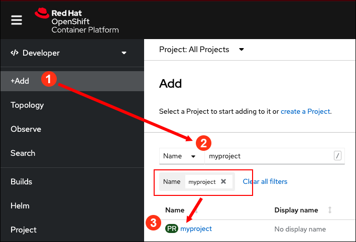
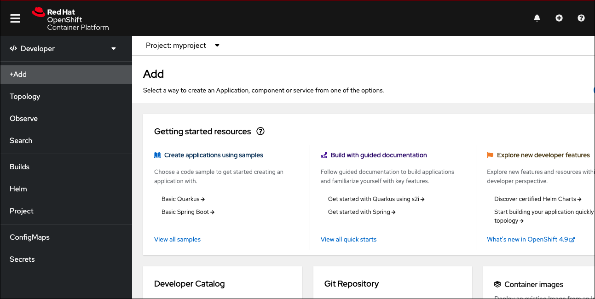

## コマンドラインを使用してOpenShiftにログインする

このトピックではコマンドラインを用いてOpenShiftにログインする方法を学習します。`myproject`という名前のプロジェクトを作成します。次にWebコンソールで、そのプロジェクトを表示します。

ログインから始めます。左側のターミナルウィンドウで次のコマンドを実行して、コマンドラインからOpenShiftクラスタにログインします。下のコマンドラインをクリックすると、クリップボードにコピーされます。コピーされた内容を、左側のターミナルにペーストしてください。

----

`Step 1:` 次のコマンドを実行してOpenShiftクラスタにログインします。

```
oc login -u admin -p admin https://api.crc.testing:6443 --insecure-skip-tls-verify=true
```
ログインに成功すると、次のような結果が表示されます。

```
Login successful.

You have access to 64 projects, the list has been suppressed. You can list all projects with 'oc projects'

Using project "default".
```

|Note:|
|----|
|コマンドが成功するまで、openshift-authenticationのPodが実行されるまで数分待つ場合があります。|

これはパスワードが`admin`である`admin`というユーザーで、OpenShiftクラスタのAPIサーバーにログインすることを意味しています。

* **Username:** `admin`
* **Password:** `admin`

# projectを作成する

次に、`oc` コマンドを使用して `myproject` という名前の新しいprojectを作成します。

----

`Step 2 :` `myproject` という名前のprojectを作成するために次のコマンドを実行します。

```
oc new-project myproject
```

次のような出力が表示されます。

```
Now using project "myproject" on server "https://api.crc.testing:6443".

You can add applications to this project with the 'new-app' command. For example, try:

    oc new-app rails-postgresql-example

to build a new example application in Ruby. Or use kubectl to deploy a simple Kubernetes application:

    kubectl create deployment hello-node --image=k8s.gcr.io/serve_hostname
```

# Webコンソールを使用してログインする

ユーザー名 / パスワード `admin/admin` を使用してWebコンソールにログインします。

----

`Step 3 :`  左側上部にある **Web Console** タブをクリックします。

ブラウザの新しいタブが開き「警告：将来の潜在的なセキュリティリスク（Firefoxの場合）」が表示されますが「詳細情報」をクリックして進みます。これは、自己証明書を使用しているために出力でれるものです。警告は2回表示されます。次の図に示すようなログインページが表示されます。



ログインするために、ユーザー名 / パスワード `admin/admin` を入力します。

ログインすると **Administrator** perspectiveになります。Webコンソールの右上の部分に  **Administrator** と表示されています。

|Note:|
|----|
| Webコンソールが **Administrator** ではなく **管理者** のように日本語で表示される場合は、英語に変更したい場合は次の操作を行ってください。Webコンソール画面右上のユーザ名 (admin) をクリックして [ユーザー設定] のメニューを開きます。次に表示される画面で [言語] メニューを選択すると、「Use the default browser language setting.」のチェックボックスにチェックが入っています。このチェックボックスのチェックを外し、[言語の設定] のドロップダウンリストから、[English] を選択します。最後にブラウザで再読み込みすると、英語のWebコンソールが表示されます。|


# Developer perspectiveに切り替える

次は **Developer** perspectiveに切り替えます。

----

`Step 4 :`  次の図に示すように、ドロップダウンから `Developer` を選択し **Developer** perspectiveに切り替えます。



# projectを選択する

次にWebコンソールで、先程作成したprojectを選択します。

`Step 4(1):` **Developer** perspectiveのメニューにある **Add** ボタンをクリックします。するとprojectのリストが表示されます。

`Step 4(2):` 検索する単語として `myproject` を検索ボックスに入力します。

`Step 4(3):` リストの中から `myproject` をクリックします。

これらの3つのアクションの詳細は、次の図に示されています。



以下の図のように様々なコレクションを含むテキストブロックがある **Add** ページが表示されます。



# Congratulations!

このトピックは完了です。

----

**NEXT:** Webコンソールを使用してアプリケーションをデプロイします

