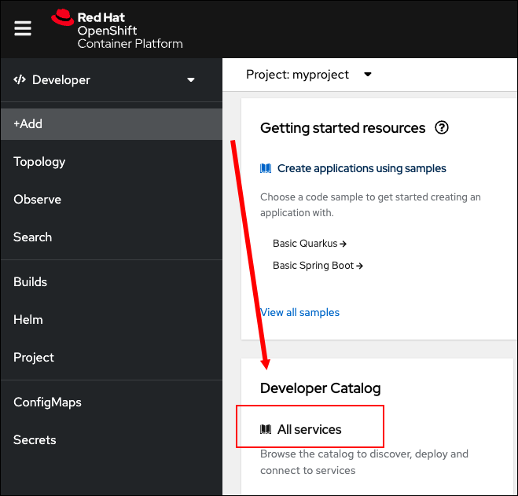
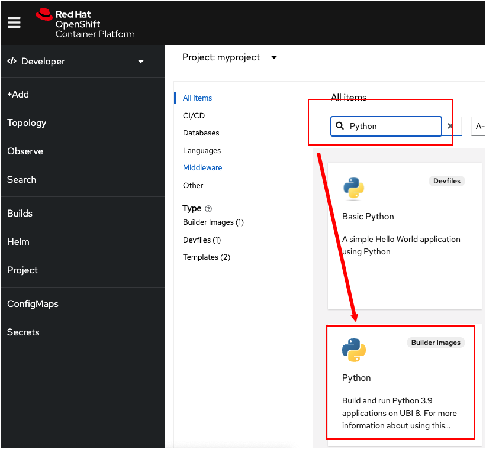
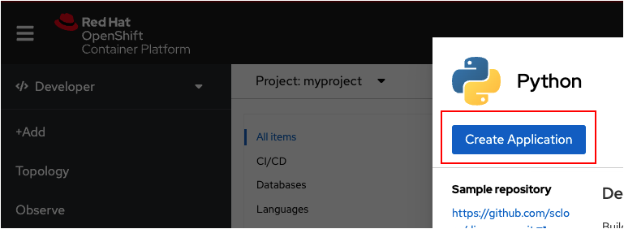
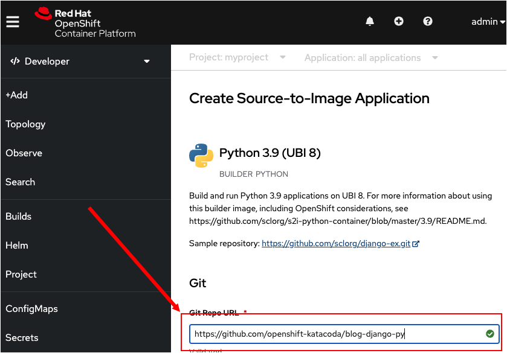
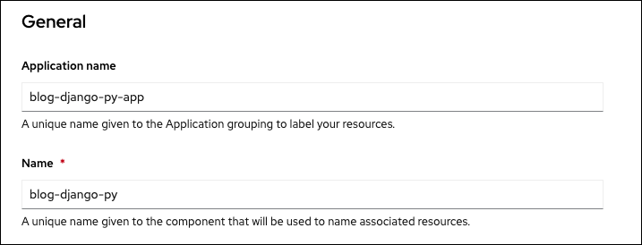
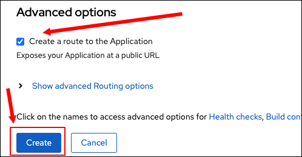
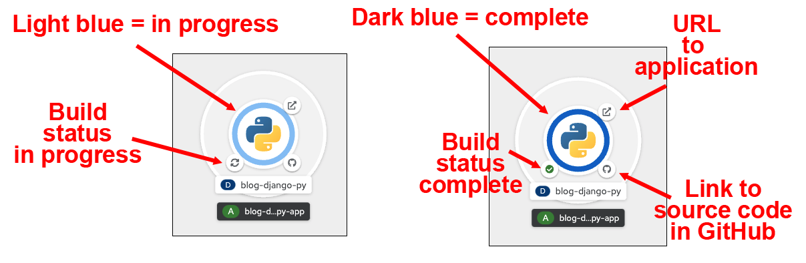
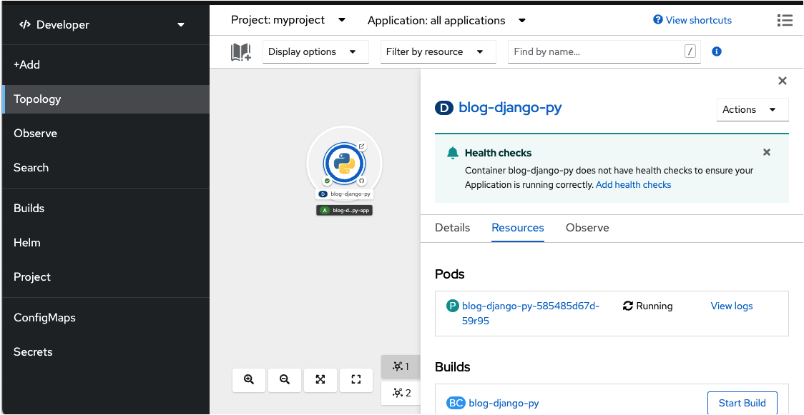

このトピックではWebコンソールを使用して、Githubにあるソースコードからアプリケーションを作成してデプロイします。

# Selecting a service

まず、デプロイするアプリケーションの種類を選択する必要があります。 **Developer Catalog** からサービスを選択します。今回はデモの目的でPythonのアプリケーションを作成します。

`Step 1a:` Webコンソールで左サイドにある **Add** ボタンをクリックします。いくつかのテキストブロックがある **Add** ページが表示されます。

`Step 1b:` 少し下にスクロールして、下の図に示すように **Developer Catalog** の中の **All services** をクリックします。



----

様々な種類のテキストブロックが表示されるので、検索ボックスを使って特定の単語で検索します。

`Step 2a:` 検索テキストボックスに `python` と入力します

Pythonに関連するもののみが表示されます。

`Step 2b:` 以下の図のように、 **Python** のラベルが付いたもので、`Builder Images` とあるものをクリックします。




----

`Step 3:` 以下の図のように、 **Create Application** ボタンをクリックします。



**Create to Source-To-Image Application** というタイトルのページが表示されます。このページを使用して、GutHubに保存されているソースコードをOpenShiftにインポートします。OpenShiftの「Source-To-Image」機能を利用して、GithHubレポジトリのソースコードに基づいてLinuxコンテナを作成します。

----

`Step 4:` **Create to Source-To-Image Application** ページの **Git** セクションに **Git Repo URL** を入力します。

次のテキストをクリックしてコピーします。

```
https://github.com/openshift-instruqt/blog-django-py
```

以下の図のように **Git Repo URL** のテキストボックスに、コピーした文字列を貼り付けます。



----

`Step 5a:` ページを下にスクロールします。 **Create to Source-To-Image Application** ページの **General** セクションにある、**Application　　Name** と **Name** は、下の図のように自動的に入力されます。



スクロールを続けます。

**Advanced options** セクションで、 **Create a route to the Application** チェックボックスが選択された状態になっています。これは、OpenShiftが、インターネットからアプリケーションにアクセスするためのURLを自動的に作成することを意味します。




`Step 5b:` 最後に **Create** ボタンをクリックします。このアクションによって、ソースコードデータが保存され、アプリケーションのビルドプロセスが開始されます。

次の図のように、ビルドの進行中に、Webコンソールの **Topology overview** が表示されます。


# Topology overview のアプリケーショングラフィックの構造

**Topology** ページは、特定のproject内に展開されている各コンポーネントの視覚的表現が表示されます。この場合、 `myproject` はPythonアプリケーションのデプロイのみが含まれています。そのため、ひとつの図形のみ表示されています。

Pythonアプリケーションの図形には、Pythonロゴを囲む青い円があることがわかります。また、円の周りには小さなアイコンがいくつかあります。

円の色と、円を囲むアイコンには特別な意味があります。次の図は、これらの各グラフィック要素の意味を示しています。



円の右下に表示されているGitアイコンをクリックすると、ビルドされたアプリケーションのソースコードがホストされているGitレポジトリに移動できます。

左下に表示されているアイコンはアプリケーションのビルドステータスを表しています。アイコンは、ビルドが開始されていることを示す砂時計の表示から、ビルドが進行中であることを示す同期アイコンに変わり、最後に、ビルドが成功したか失敗したかに応じてチェックマークまたがクロスマークに変わります。このアイコンをクリックすると、現在のビルドの詳細に移動します。

アプリケーションが実行されたら、右上に表示されているアイコンをクリックして、作成されたアプリケーションへのrouteのURLを開くことができます。

リング自体は、デプロイが保留中である白から、デプロイが開始されていることを示す水色、アプリケーションが実行中である青に進みます。アプリケーションが停止している場合、濃い青に変わることもあります。

リングで囲まれた領域の任意の場所をクリックすると、次の図に示すように、アプリケーションのリソースの詳細を示すパネルが表示されます。



# Congratulations!

Webコンソールと「Create to Source-To-Image Application」機能を使用してPythonアプリケーションをデプロイするプロセスを開始しました。

----
**NEXT:** Webコンソールでデプロイのビルドログを表示します