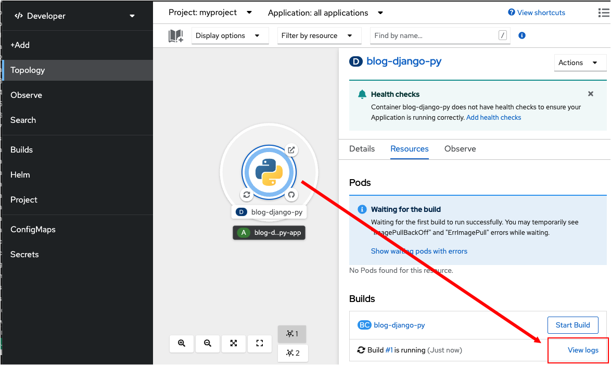
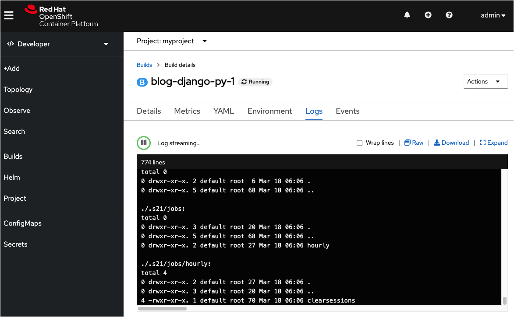

このトピックではWebコンソールでデプロイメントのログを表示する方法を学習します。前のトピックで実施したPythonアプリケーションのデプロイのログを表示します。

----

`Step 1:` 左側のターミナルの横の **Web Console** タブをクリックします。

Webコンソールの **Topology** ページにいて、 Pythonアプリケーションのデプロイのグラフィックが見えていることを確認してください。

----

`Step 2:`　Pythonデプロイのグラフィックをクリックします。

デプロイの詳細が、ページの右側に表示されます。右下に **View logs** というボタンが表示されます。

----

`Step 3:` 次の図に示すように **View logs** ボタンをクリックします。

**View logs** ボタンをクリックすると、次の図に示すように、ログデータを表示するパネルが表示されます。

デプロイのログを表示すると、実行中のビルドの進行状態をモニタできます。ビルドが正常に完了するとPush successfulというメッセージが表示されます。これが、アプリケーションのコンテナイメージがOpeｎShift内部のイメージレジストリーにプッシュされ、アプリケーションが稼働中であることを示しています。

# Congratulations!

Webコンソールで、デプロイのログを表示する方法を学習しました。

----

**NEXT:** インターネットからアプリケーションにアクセスします
