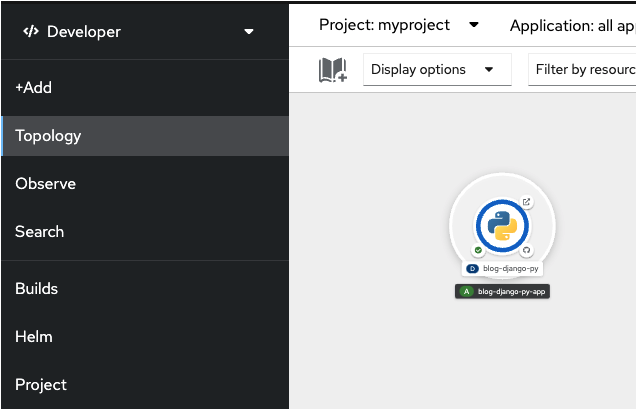
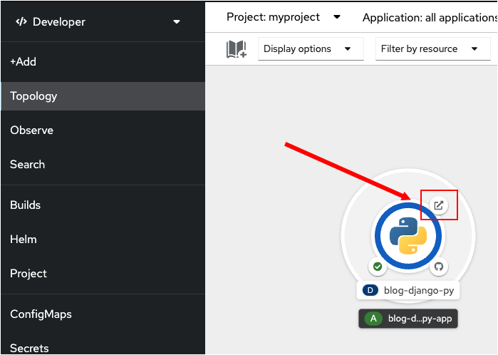
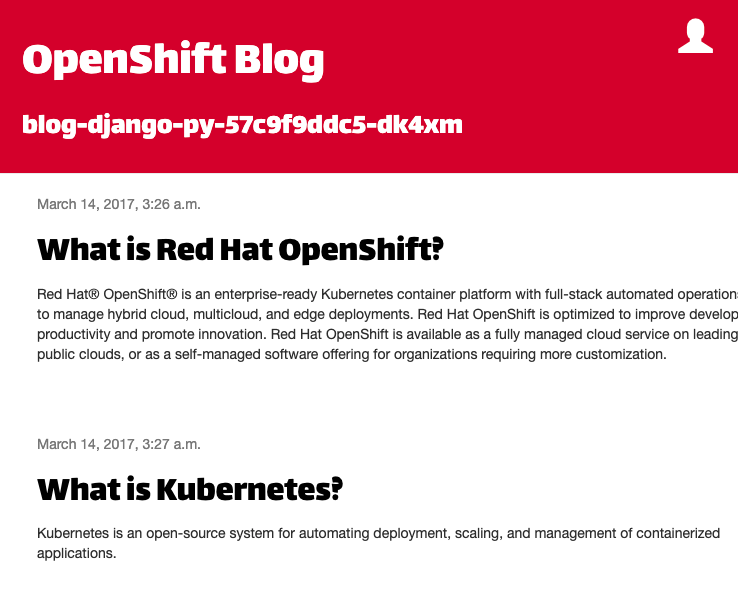

前のトピックでは、Pythonアプリケーションをビルドしてデプロイしました。このトピックでは、OpenShiftによって割り当てられた **Route** を使用して、TopologyページからWebブラウザーでアプリケーションを開きます。

----

`Step 1:` 左側のターミナルの横にある **Web Console** タブをクリックします。

左のメニューから **Topology** ボタンをクリックして、projectのtopology viewに戻ります。

前のトピックで読んだように、Webコンソールを使用してアプリケーションを作成すると、アプリケーションのための `route` が自動的に作成されます。`route` はアプリケーションをインターネットに公開します。OpenShiftによって作成された `route`'のURLを使用して、Webブラウザからアプリケーションにアクセスします。

----

`Step 2a:` 下の図で示すように、topology viewで、アプリケーションを視覚化したグラフィックの右上のアイコンをクリックして、デプロイされたアプリケーションのURLにアクセスします。

Pythonロゴのを囲むリングが濃い青であることを確認します。

`Step 2b:` 上の図に示すように、URLを開くためのアイコンをクリックします。

アイコンをクリックすると、ブラウザの新しいタブが開いて、下の図に示すようなブログWebサイトが表示されます。

このWebサイトは、GitHubのソースコードからビルドし、Webコンソールを使用してデプロイしたPythonアプリケーションによって動いています。

# Congratulations!

Webコンソールを使用して、ソースコードからアプリケーションを正常にビルドおよびデプロイできました。

----
**NEXT:** OpenShift CLIツールを使用して、コマンドラインからデプロイメントを削除します。