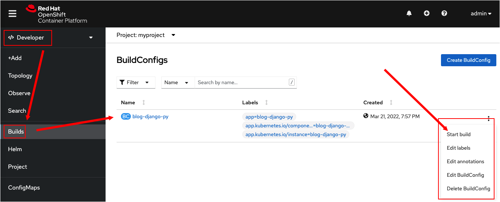
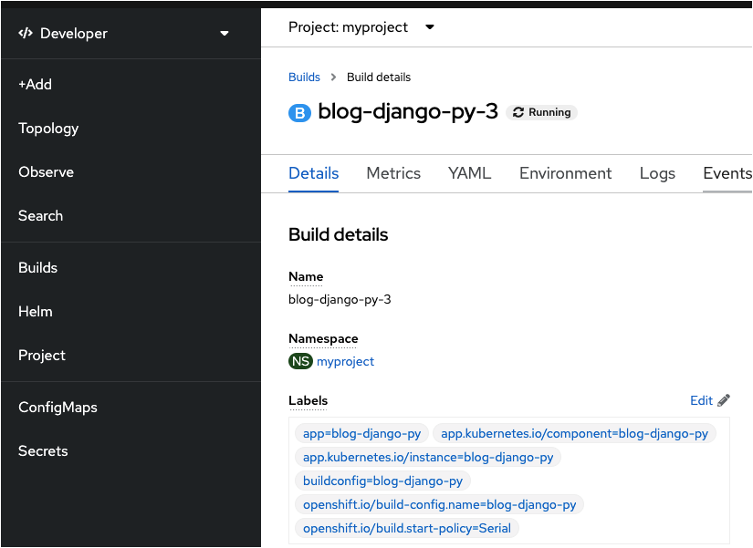
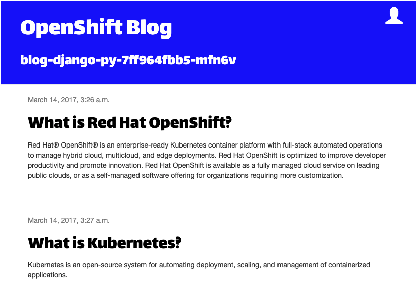

このトピックでは、コマンドラインを使用して、OpenShiftですでに実行されているアプリをリビルドする方法を学習します。また、ソース管理でコードが変更されたときにOpenShiftでリビルドを実行する方法についても学習します。

----

#  コマンドラインからビルドをトリガーする

変更を加えた後に新しいビルドをトリガーする方法は、`ocstart-build` コマンドを使用することです。

`Step 1:` 次のコマンドを実行して blog-blog-django-py をリビルドします。

```
oc start-build blog-django-py
```

次のような出力が得られます。

```
build.build.openshift.io/blog-django-py-2 started
```

Webコンソーからビルドをトリガーすることもできます。 Webコンソールからビルドを実行してみましょう。 console UI.

# Webコンソールからビルドをトリガーする

`Step 2a:` 下の図に示すように、Developer perspectiveの左側にあるメニューから **Builds** へ行きます。

`Step 2b:` ビルドのページの右サイドにあるドロップダウンメニューから **Start build** をクリックします。



次の図のような結果が表示されます。.



---

前述のように、 `oc logs`を使用して、ビルドの実行中にログ出力をモニタできます。次のコマンドを実行して、プロジェクトのビルドの進行状況をモニタすることもできます。

`Step 3:` 次のコマンドを実行して、実行中のビルドの進行状況をモニタします。

```
oc get builds --watch
```

ビルドが進むにつれて、次のような出力が表示されます。

```
NAME               TYPE     FROM          STATUS     STARTED          DURATION
blog-django-py-1   Source   Git@9c4f338   Complete   3 minutes ago        1m44s
blog-django-py-2   Source   Git@9c4f338   Running    About a minute ago
blog-django-py-3   Source   Git
```

----

`Step 4 :` ターミナルウィンドウの` CTRL + C`キーを押して、ビルドのモニタを終了します。

----

`Step 5 :` 次のコマンドを実行して、ビルドのコンフィグに関する情報を表示します。

```
oc describe bc/blog-django-py
```

次のような出力が得られます。

```
Name:           blog-django-py
Namespace:      myproject
Created:        2 minutes ago
Labels:         app=blog-django-py
                app.kubernetes.io/component=blog-django-py
                app.kubernetes.io/instance=blog-django-py
Annotations:    openshift.io/generated-by=OpenShiftNewApp
Latest Version: 3

Strategy:       Source
URL:            https://github.com/openshift-instruqt/blog-django-py
From Image:     ImageStreamTag openshift/python:latest
Volumes:        <none>
Output to:      ImageStreamTag blog-django-py:latest

Build Run Policy:       Serial
Triggered by:           Config, ImageChange
Webhook GitHub:
        URL:    https://api.crc.testing:6443/apis/build.openshift.io/v1/namespaces/myproject/buildconfigs/blog-django-py/webhooks/<secret>/github
Webhook Generic:
        URL:            https://api.crc.testing:6443/apis/build.openshift.io/v1/namespaces/myproject/buildconfigs/blog-django-py/webhooks/<secret>/generic
        AllowEnv:       false
Builds History Limit:
        Successful:     5
        Failed:         5

Build                   Status          Duration                Creation Time
blog-django-py-3        new             waiting for 24s         2022-03-22 16:14:22 +0000 UTC
blog-django-py-2        running         running for 43s         2022-03-22 16:14:03 +0000 UTC
blog-django-py-1        complete        1m43s                   2022-03-22 16:12:02 +0000 UTC

Events: <none>
```

`describe` の出力に、ソースコードをホストするgitリポジトリの詳細が表示されます。

上記の`describe`出力には、GitHub Webhook URLのリストがあることに注意してください。 gitホスティングサービスを使用してこれらのURLを構成し、変更がコミットされてgitリポジトリにプッシュされたときに新しいビルドを自動的にトリガーすることができます。ただし、ビルドを自動的にトリガーするには、特定のリポジトリまたはリポジトリのフォークでの所有権の許可が必要です。

# ローカルコードを使用してビルドをトリガーする

アプリケーションを開発するときの一般的なワークフローは、ローカルマシン上でコードを作成および更新します。次に、変更を行う準備ができたら、更新されたコードをローカルでコミットし、ビルドコンフィグにリンクされたgitリポジトリに更新をプッシュします。 Webhookが構成されている場合、コミットが行われると、新しいビルドとデプロイメントが自動的にトリガーされます。また、新しいビルドを手動でトリガーすることもできます。

OpenShiftを使用すると、ローカルファイルシステムに保存されている変更されたコードに対してビルドをトリガーできます。変更をgitにコミットする作業を行う必要はありません。 OpenShiftにローカルに保存されているコードのビルドは、バイナリー入力ビルド（binary input build）と呼ばれます。

バイナリー入力ビルド（binary input build）をトリガーしてみます。

`Step 6:` 左側のターミナルウィンドウで次のコマンドを実行して、デモアプリケーションのソースコードを含むgitリポジトリのクローンを作成します。

```
git clone https://github.com/openshift-instruqt/blog-django-py
```

次のように出力されます。

```
Cloning into 'blog-django-py'...
remote: Enumerating objects: 3, done.
remote: Counting objects: 100% (3/3), done.
remote: Compressing objects: 100% (3/3), done.
remote: Total 412 (delta 0), reused 0 (delta 0), pack-reused 409
Receiving objects: 100% (412/412), 68.49 KiB | 556.00 KiB/s, done.
Resolving deltas: 100% (200/200), done.
```

リポジトリのクローンを作成すると、アプリケーションのソースコードを含むサブディレクトリ`blog-django-py`が作成されます。

----

`Step 7:` 次のコマンドで、ソースコードがある作業ディレクトリに移動します。

```
cd blog-django-py
```

----

`Step 8:` `次のコマンドを実行して、変更をgitリポジトリにコミットする必要なしに、アプリケーションソースコードのローカルコピーからビルドをトリガーする方法を示します。

```
echo 'BLOG_BANNER_COLOR=blue' >> .s2i/environment
```

上記の`echo`コマンドは、OpenShiftの` source code to image`（S2I）機能で使用される環境変数の1つを更新します。 `echo`コマンドは、環境変数`BLOG_BANNER_COLOR`の値を`blue`に変更します。この変更により、ブログ投稿のヘッダー領域の背景色が変更されます。

----

`Step 9:` 次のコマンドを実行して、新しいビルドを開始します。

```
oc start-build blog-django-py --from-dir=. --wait
```

次のような出力が得られます。

```
Uploading directory "." as binary input for the build ...
...................
Uploading finished
build.build.openshift.io/blog-django-py-4 started
```

このバージョンの`ocstart-build`の実行は、オプション設定 `--from-dir=.` がコマンドに渡されることを除くち、前に実行したものと似ています。

オプション設定`--from-dir= .`は、コマンドを実行しているホスト上のディレクトリから、ローカルのソースコードをアップロードする必要があることを示します。ローカルのコードを使用してビルドすると、ホストされているgitリポジトリからのソースコードをダウンロードすることを回避されます。

`` --wait``オプションは、ビルドが完了した時にのみコマンドが制御を返す必要があることを示すために提供されています。このオプションは、ビルドコマンドをスクリプトに統合する場合に役立ちます。後続のコマンドを実行する前に、ビルドが完了していることを確認する必要があります。

----

`Step 9:` サンプルコードが実行されているWebページに移動します。次の図に示すように、Webページのヘッダーセクションの色が青に変わっていることがわかります。



`` --from-dir=.``オプションを``oc start-build``とともに使用すると、現在の作業ディレクトリの内容はそのビルドでのみ使用されます。

ローカルディレクトリのソースコードを使用してさらにビルドを実行する場合は、毎回 ``--from-dir=.``を指定する必要があります。

# ビルドを元に戻す

`Step 10:` 次のコマンドを実行して、Webページのレンダリングを、gitリポジトリでホストされているソースコードを使用したものに戻します。

```
oc start-build blog-django-py
```
次のような出力が表示されます。

```
build.build.openshift.io/blog-django-py-5 started
```

# Webコンソールでビルドを表示する

Webコンソールからビルドを実行することもできます。

`Step 11a:` アプリケーションの詳細から、ログを表示して進行状況をモニタするように、Webコンソールに切り替えます。

`Step 11b:` 左側のメニューから **Build** を選択します。

`Step 11c:` **Builds** タブを選択して、`blog-django-py-3` をクリックして、`blog-django-py` のためのビルドコンフィグを選択します。

# ビルドのキャンセル

何らかの理由でビルドが誤って開始された場合や、ビルドが失敗することに気付いた場合は、ビルドの名前を指定して `oc cancel-build`を実行し、ビルドをキャンセルできます。

`Step 11:` 次のコマンドを実行して `blog-django-py-5`　という名前のビルドをキャンセルします。

```
oc cancel-build blog-django-py-5
```

ビルドがキャンセルされたことを示す出力が表示されます。

```
build.build.openshift.io/blog-django-py-5 marked for cancellation, waiting to be cancelled
build.build.openshift.io/blog-django-py-5 cancelled
```

----

`Step 12:` 次のコマンドを実行して、ビルドがキャンセルされたことを確認します。

```
oc get builds
```

次のように出力されます。

```
NAME               TYPE     FROM             STATUS                       STARTED              DURATION
blog-django-py-1   Source   Git@9c4f338      Complete                     9 minutes ago        1m43s
blog-django-py-2   Source   Git@9c4f338      Complete                     7 minutes ago        1m41s
blog-django-py-3   Source   Git@9c4f338      Complete                     5 minutes ago        1m48s
blog-django-py-4   Source   Binary@9c4f338   Complete                     4 minutes ago        1m44s
blog-django-py-5   Source   Git@9c4f338      Cancelled (CancelledBuild)   About a minute ago   50s
```

`blog-django-py-5` のビルドがキャンセルされていることがわかります。

|NOTE:|
|----|
|自分のマシンのローカルディレクトリからソースコードを使用してビルドを開始するのは、コマンドラインからのみ実行できます。 Webコンソールからそのようなビルドをトリガーする方法はありません。|

----

# Congratulations!

このトピックを完了しました。 コマンドラインからビルドをトリガーしました。 次に、Webコンソールを使用してビルドをトリガーしました。 また、ソースコードをローカルで更新し、更新されたコードを使用してビルドを実行しました。 デモ用アプリケーションのWebサイトを元の状態にリセットするビルドを実行しました。 最後に、ビルドを開始してキャンセルしました。

これがこのトラックの最後のトピックです。