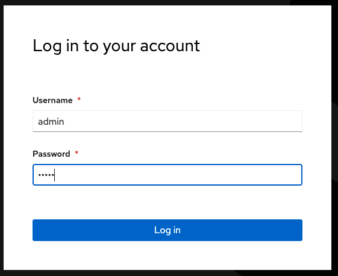
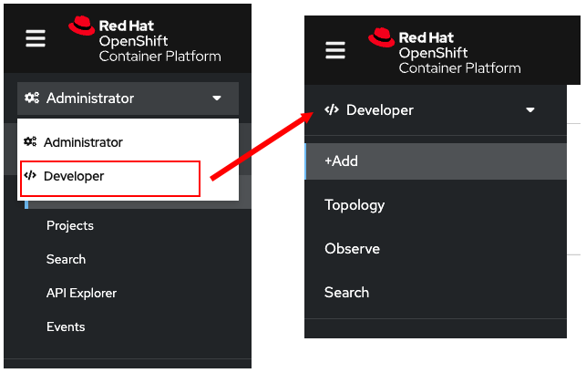

このトピックではWebコンソールを使用してOpenShiftクラスタにログインして、ログイン後に新しいアプリケーションを作成する方法を学習します。

# Webコンソールでログインする

最初のタスクはWebコンソールを使用してOpenShiftクラスタにログインすることです。

----

`Step 1:` 左側上部にある **Web Console** タブをクリックします。ブラウザの新しいタブが開き「警告：将来の潜在的なセキュリティリスク（Firefoxの場合）」が表示されますが「詳細情報」をクリックして進みます。これは、自己証明書を使用しているために出力でれるものです。警告は2回表示されます。

OpenShiftのログイン画面が表示されるので、次のユーザー名とパスワードを使用してログインします。

* **Username:** `admin`
* **Password:** `admin`

次の図に示すように、Webコンソールにログインします。



ログイン後は、左側のメニューを確認してください。次の図のように、 **Administrator** になっています。


**Administrator** から **Developer** に切り替えます。

----

`Step 2:` 次の図のように、Webコンソールの左側のメニューのドロップダウンから **Developer** を選択します。



**Developer** になったので、OpenShiftの **project** の概念について説明します。

# OpenShiftのprojectを理解する

OpenShiftは[Linux containers](https://developers.redhat.com/topics/containers)でアプリケーションを開発およびデプロイするために設計されたプラットフォームであるという点から、アプリケーションプラットフォームと呼ばれることがよくあります。

OpenShiftでは **project** という名前の組織単位があります。 **project** を使用して、アプリケーション内のリソースをグループ化します。アプリケーションを **project** に編成する理由は、開発者またはチームに対してアクセスやクォータを制御できるようにするためです。**project** は開発者のアクセス制御に基づくKubernetes namespaceの視覚化と考えることができます。

それではprojectを作成してみましょう。

# projectを作成する

このセクションでは、Webコンソールを使用してprojectを作成します。

----

`Step 3:` **Web Console** タブの左側のメニューで **+Add** をクリックします。

----

`Step 4:`次の図のように、**Create a project** が表示されるので、そのテキストをクリックします


プロジェクトの詳細を入力する **Add Project** ダイアログが表示されます。

----

`Step 5:`project名のテキストボックスに `myproject` と入力して、 `Create` ボタンをクリックします。


----

`Step 6:` 次のような **Add** ページが表示されます。Webコンソール上部のProjectが `myproject` になっていることを確認してください。ページをスクロールして、 `Container images` というテキストブロックをクリックします。


----

`Step 7:` 次のように **Deploy Image** の入力フォームが表示されます。


----

`Step 8:` **Image name from external registry** の部分に、次のテキストをコピーしてペーストします。外部のレジストリにあるparksmapというアプリケーションのイメージを指定しています。

```
quay.io/openshiftroadshow/parksmap:1.3.0
```

フォームの他の部分はオプションです。今回は特には入力しません。

----

`Step 9:` ページを下にスクロールして、 `Create` ボタンをクリックします。

しばらくするとアプリケーションが作成されます。アプリケーションが作成されたあと、左側の **Topology** をクリックすると次のように表示されます。これでアプリケーションの準備が整いました。


# Congratulations!

Webコンソールを使用して、コンテナイメージからアプリケーションをデプロイすることができました。

----
**NEXT:** アプリケーションのスケーリングを行います
