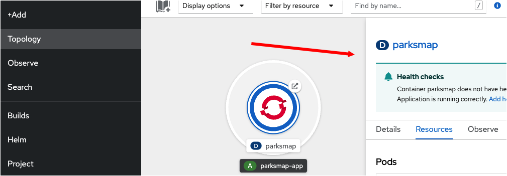
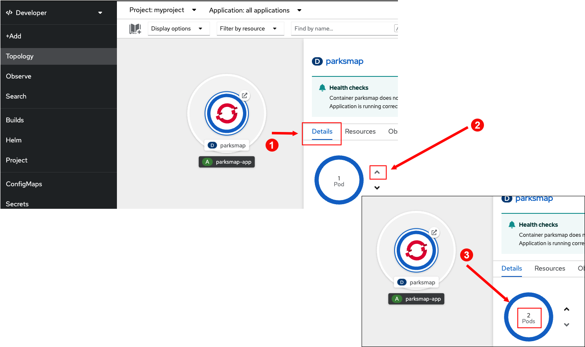
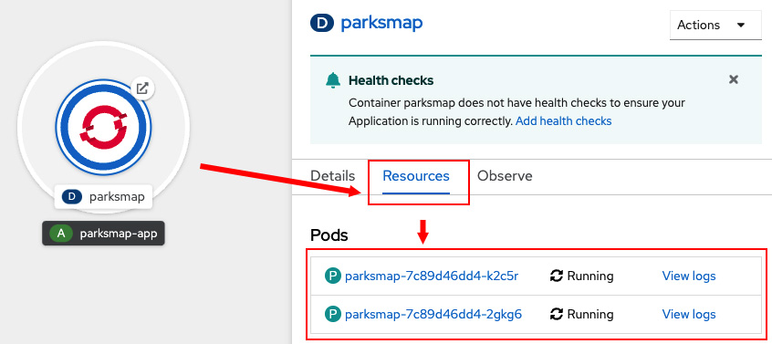
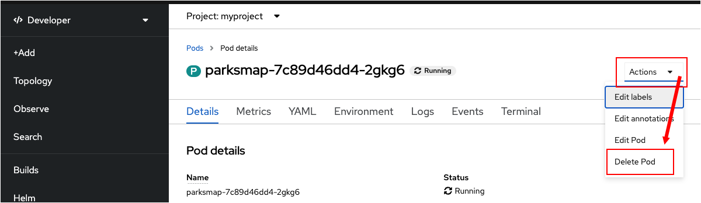
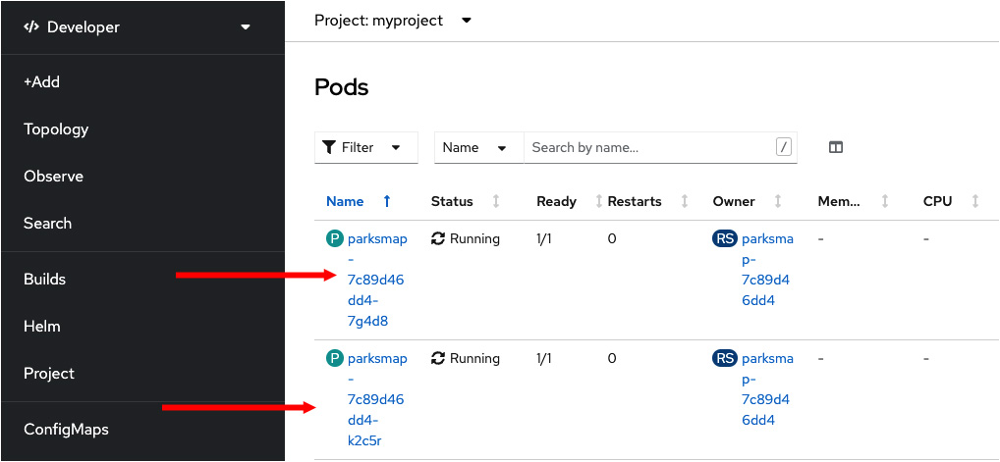
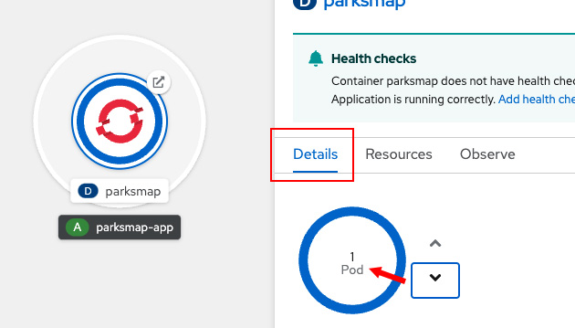

このトピックでは、クラスタ内のアプリケーションを表すPodのレプリカを作成して、アプリケーションをスケールする方法を学習します。Red Hat OpenShifは、すべてのレプリカを単一のアプリケーションであるように見せます。背後では、OpenShiftはレプリカに対してトラフィックを自動的にルーティングしています。Podを複製する利点は、アプリケーションが対応できるインターネットトラフィックの量を増やすことができる点です。その結果、全体的なパフォーマンスが向上します。

# アプリケーションをスケールアップする

アプリケーションを2にスケールアップします。

----

`Step 1:` **Topology** の中にある、`parksmap` アプリケーションの円の内側をクリックします。次の図に示すように、詳細ウィンドウがサイドパネルに表示されます。

----

`Step 2:` サイドパネルで **Details** タブをクリックします（①）。次にPodの横にある上の矢印をクリックして（②）、Podの数を2に増やします（③）。 （ [`pod` はKubernetesの用語です](https://kubernetes.io/docs/concepts/workloads/pods/). このケースでは `pod` はアプリケーションのインスタンスを指します。)　これで、アプリケーションのレプリカが2つ実行されるようになります。

# レプリカの数を確認する

----

`Step 3:` レプリカ数の変更の確認をするためにはサイドパネルにある **Resources** タブをクリックします。次の図に示すように、Podのリストが表示されます。

2つのレプリカがあることがわかります。それでは、OpenShiftのセルフヒーリング機能を見てみましょう。セルフヒーリング機能により、アプリケーションのために宣言されている数のPodが、常に実行されていることが保証されています。

# アプリケーションのセルフヒーリングを理解する

OpenShiftアプリケーションでは **Deployments** が常に監視されており、必要な数のPodが実際に実行されていることを確認しています。したがって、実際の状態が、希望する状態から逸脱した場合は（例えばあるPodがダウンした場合など）OpenShiftは状況を修正します。

Podのひとつを強制終了して、OpenShiftがPodを復活させるかどうかを確認してみましょう。

----

`Step 4:` レプリカ数を2にスケーリングした後のPodのリストを **Resources** タブで表示します。次の図に示すように、リスト内のPodの1つの名前をクリックします。名前は環境ごとに異なるので、この図とまったく同じ訳ではありません。どちらか1つを選んでください。

----

`Step 5:` ページの右上に **Actions** というドロップダウンメニューがあります。これをクリックして **Delete Pod** を選択します。

Podを削除すると、Podを一覧表示するページが表示されます。次の図に示すように、Podのうちの1つを削除しても2つのPodが実行されています。

OpenShiftは、Podを常に確認しており、停止したことを認識すると、代替のPodを作成します。

# アプリケーションのスケールダウン

次のトピックに進む前に、アプリケーションを1インスタンスにスケールダウンします。

----

`Step 6a:` 左側のメニューの **Topology** をクリックします。

`Step 6b:` `parksmap` の円をクリックします。

`Step 6c:` サイドパネルの **Details** タブをクリックします。

`Step 6d:` 下の図に示すように、Podの円の右側にある下向きの矢印をクリックして、Podの数を1にセットします。

# Congratulations!

Webコンソールを使用して、アプリケーションのレプリカPodの数をスケールアップ、スケールダウンする方法を学習しました。

----

**NEXT:** アプリケーションへのrouteの確認