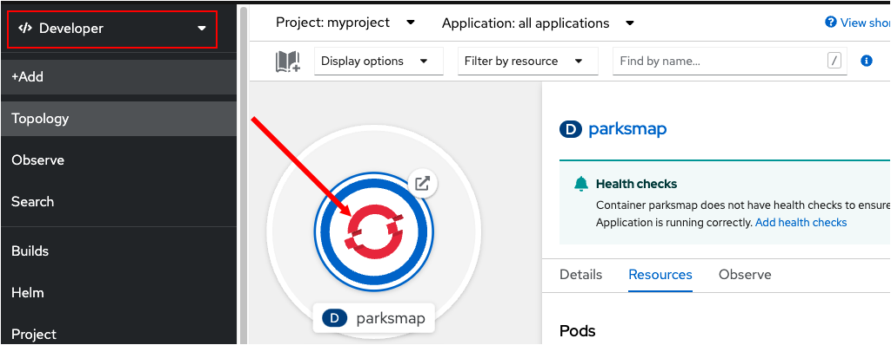
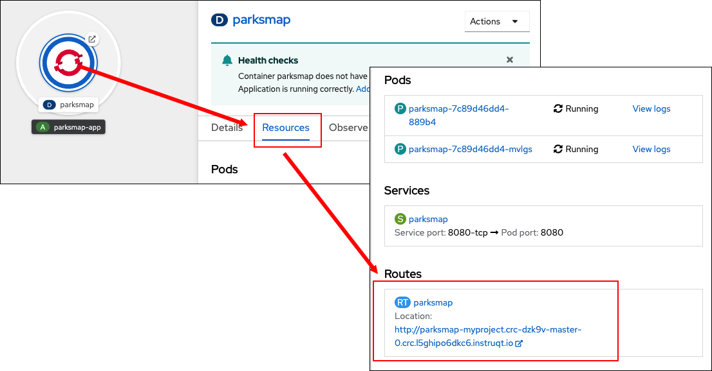
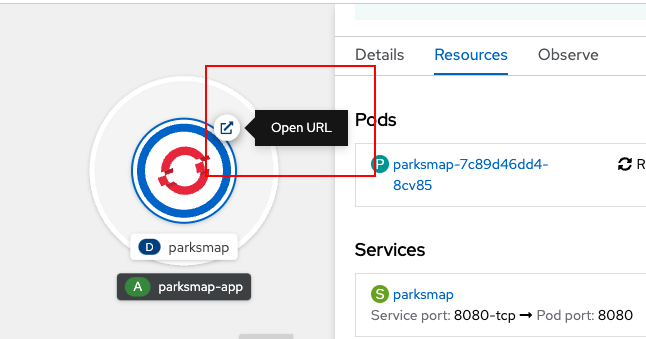
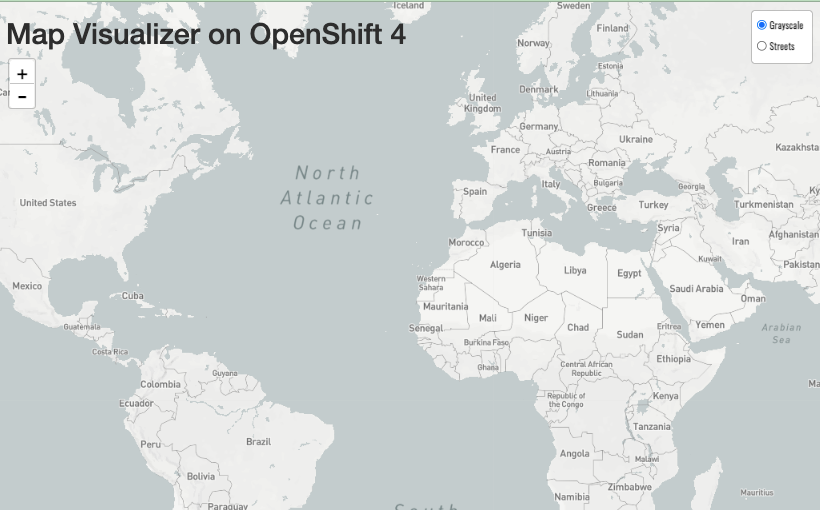

このトピックでは **routes** について学習します。

OpenShiftでは **service** リソースはアプリケーションへの内部アクセスを抽象化し、これはアプリケーションのPodで表されます。また  **service** はOpenShift内で負荷分散機能を提供します。アプリケーションPodへの **service** のバインドは、OpenShiftクラスタの内部のものです。外部のクライアントがOpenShiftで稼働しているアプリケーションにアクセスする方法は、OpenShiftルーティングレイヤーを介して行われます。

ルーティングレイヤーを表すリソースの正式名称は **route** と呼ばれます。

トピック2で実施したように、 **container image** からアプリケーションを作成すると、OpenShiftは自動的にアプリケーションのための **route** を作成します。**route** が公開されている場所を見てみましょう。次に、routeのURLを使用して、ブラウザからアプリケーションにアクセスします。

# routeのURLを表示する

`Step 1:` アプリケーションの **route** を表示するには、左側のメニューバーのドロップダウンリストから **Developer** を選択します。 次に **Topology** ビュー内から次の図に示すように、アプリケーションの円をクリックします。

Podの情報は右側のサイドパネルに表示されます。

----

`Step 2:` サイドパネルの **Resource** タブをクリックします。

----

`Step 3:` 下の図に示すように、ページの下部にある **Routes** セクションまでスクロールダウンします。

アプリケーションのroute URLがリンクとして表示されます。

----

`Step 4:` そのリンクをクリックしてアプリケーションのWebページをブラウザにロードします。

# RouteのURLにアクセスする

**Topology** のページのアプリケーションの円のから **route** URLに直接アクセスすることもできます。

----

`Step 5:` 次の図に示すように、アプリケーションの円の右上にあるアイコンをクリックします。

アイコンをクリックすると、次の図に示すように、ブラウザでアプリケーションのWebページが開きます。

----

# Congratulations!

Webコンソールでアプリケーションの**route** URLを見つること、また、アプリケーションの詳細の **Resource** タブ、および **Topology** のアプリケーションの円形の図から直接、Webページでアプリケーションを開く方法を学習しました。

これが本トラックの最後のトピックです。
