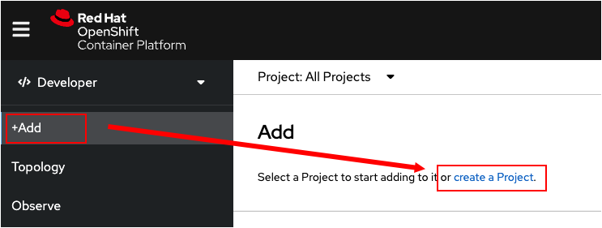

このトピックでは、コマンドラインを使用してOpenShuftのWebコンソールにアクセスするためのURLを検出する方法を学習します。また、Webコンソールを使用してOpeｎShiftのプロジェクトを作成し、そのプロジェクトを使用して作業を行います。

# WebコンソールのURLの検出

WebコンソールのURLの検出には2段階のプロセスがあります。まず最初に、WebコンソールがOpenShiftクラスタで稼働しているか確認する必要があります。次に、クラスタで実行されているWebコンソールのURLを取得するために`route`というリソースオブジェクトを確認します。

`Step 1:` 次のコマンドを実行して、WebコンソールのPodが使用可能であること確認します。（Podの準備ができるまで、1分程度待つ場合があります）：

```
oc get pods -n openshift-console | grep console
```

コマンドを実行すると次のように出力されます。Runningと表示されれば使用可能な状態です：

```
console-7d599cbf78-4xc9v     1/1     Running   0          23mD
```

----

`Step 2:` 次のコマンドを実行して、Webコンソールへのrouteを確認します：

```
oc get routes console -n openshift-console -o jsonpath='{"https://"}{.spec.host}{"\n"}'
```

Instruqt上で実行されているこのOpenShiftクラスタ固有のWebコンソールのURLが表示されます。**以下のURLは例であり、実際に表示されるURLとは異なります。**

```
https://console-openshift-console.crc-dzk9v-master-0.crc.q82njnglzds2.instruqt.io
```

----

`Step 3:` `oc get routes` コマンドで表示されたURLをコピーして、あなたが使用しているWebブラウザで開きます：

次の図に示すように、Webコンソールのログインページが表示されます：


次のユーザ名とパスワードを利用してログインします：

* **Username:** `developer`
* **Password:** `developer`

ログインに成功すると"Getting Started" と表示され、新しいプロジェクト作成のオプションが表示されます。

----

`Step 4:` 次の図に示すように `create a Project` をクリックします。



----

`Step 5:` 次の図に示すように作成画面が表示されるので、 `myproject` と入力し、`myproject`という名前のプロジェクトを作成します。


----

`Step 6:` プロジェクトの詳細を表示するためんｋは、Webコンソールの左側にあるメニューバーの　**Project** タブをクリックします。


# Congratulations!

 WebコンソールのURLの検出方法と新しいプロジェクトの作成方法を学習しました。

----

**NEXT:** コマンドラインを利用してログインします
