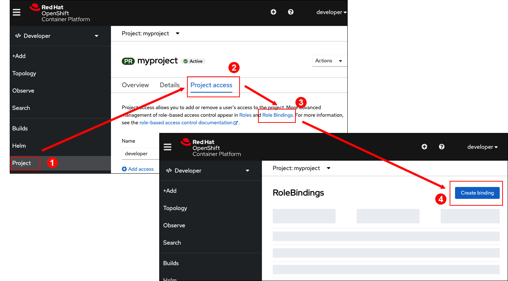
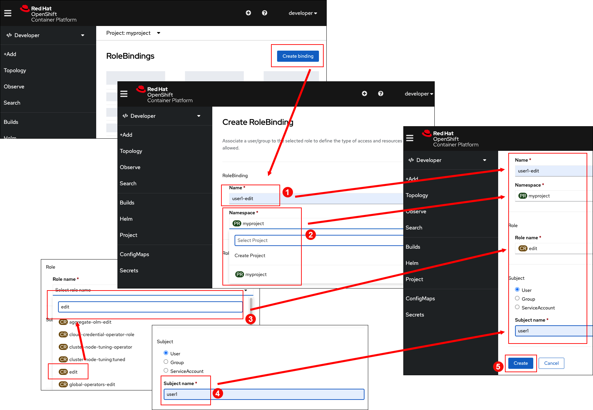
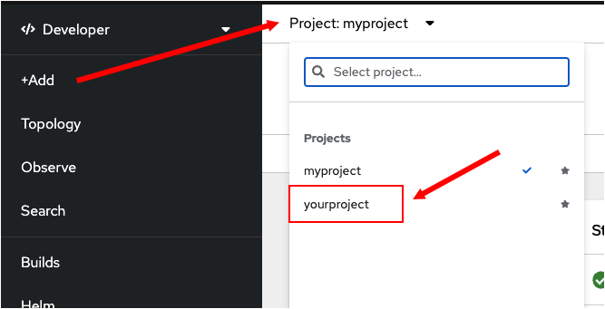

このトピックでは、別のユーザでログインする方法と、ログインしたユーザに応じてOpenShiftクラスタで操作を実行する方法を学習します。また、コマンドラインを利用して新しいユーザを作る方法についても学習します。次に、Webコンソールを利用して、OpenShiftの`rolebinding` リソースオブジェクトを介して、アプリケーションを操作するために新しいユーザに対して`edit`権限を与える方法を学習します。

OpenShiftはマルチテナントをサポートします。これは、すなわち、OpenShiftが、アプリケーションごとに独自の操作を行う
多くの異なるユーザをサポートすることを意味します。 supports multitenant clusters. This means that OpenShift supports many different users, each working on their own applications.

プロジェクトで他のユーザと共同作業するためには、他のユーザにプロジェクトへのアクセスを許可する必要があります。アクセス許可は、特定のユーザがプロジェクトにおいて実行する内容に応じて、さまざまなレベルで付与できます。To support collaboration with others on your projects, you need to grant other users access to them. Access permissions can be granted at varying levels depending on what the given user needs to be able to do in your project.

次の手順では、他のユーザと共同作業を行う方法を学習します。まず `user1`という名前の別のユーザを作成します。

# コマンドラインで新しいユーザを作成する

`Step 1:` 次のコマンドを実行し、ユーザ名が`user1`でパスワードが `user1`の新しいユーザを作成します。

```
oc login --username user1 --password user1
```

コマンドを実行すると次のような出力が表示されます:

```
Login successful.

You don't have any projects. You can try to create a new project, by running:

    oc new-project <projectname>
```

----

`Step 2:` 次のコマンドを実行し、 `user1` がアクセスできるプロジェクト一覧を表示します：

```
oc get projects
```

次のような出力が表示されます:

```
No resources found
```

 `user1`に関連付けられたリソースがないことがわかります。つまり`user1`に関連付けられたプロジェクトやアプリケーションがないと推測できます。

# OpenShiftのプロジェクトにパーミッションを付与する

`oc` コマンドを使ってユーザを作成したら、Webコンソールに移動して、プロジェクトに対して新しいユーザのアクセスを許可します。

以前に `developer`ユーザとしてWebコンソールにログインしていましたので、Webコンソールに戻って、 `developer`として操作を行います。

Webコンソールで、`myproject` に対して新しいユーザ `user1`編集権限を付与します。

# Webコンソールで `rolebinding` の設定を行う

OpenShiftでユーザに権限を付与するひとつの方法は、Webコンソールを利用して `rolebinding` リソースオブジェクトを作成することです。もうひとつの方法は、`oc` コマンドでアクセス権を付与することです。

LeWebコンソールを利用して、 `myproject`の `user1` に編集権限を付与する`rolebinding` リソースオブジェクトを作成します。

----

`Step 3:` Webコンソールに戻ります

----

`Step 4 (1):` Webコンソールの左にあるメニューバーの **Project** タブをクリックします。

 `myproject` が表示されます。

----

`Step 4 (2):` `myproject`の中の上にある **Project access** タブをクリックします。

----

`Step 4 (3):` **Project access** の中にある **Role Bindings** をクリックします

**RoleBindings** ページが表示されます。 (説明したステップを次の図に示します)



----

`Step 4 (4):`  **RoleBindings** ページの **Create binding** ボタンをクリックします、これにより **Create RoleBinding** の詳細ページが表示されます。**Create RoleBinding** ページが表示されたら、次の5ステップを実施します。

----

`Step 5 (1):`  **Name** のテキストボックスに `user1-edit` と入力します。これにより **RoleBinding** に識別可能な名前が与えられます。

----

`Step 5 (2):` **Namespace** ドロップダウンメニューから`myproject`を選択します。

----

`Step 5 (3):` **Select role name** ドロップダウンメニューから`edit`を選択します。

----

`Step 5 (4):` **Subject name** テキストボックスに `user1` と入力します. これによって、ユーザに権限がバインドされます。

----

`Step 5 (5):` **Create RoleBinding** ページの下の部分にある  **Create** ボタンをクリックします。

説明したステップを次の図に示します。



# `user1`'のプロジェクトを表示する

Now that you've bound  to the`user1-edit`という名前の **RoleBinding** に`user1` をバインドしたので、 `user1` ユーザが `myproject`というプロジェクトにアクセスできるか確認します。

----

`Step 6:` ターミナルに戻ります。

----

`Step 7:` ターミナルで、次のコマンドを実行し `user1`が見ることが可能なプロジェクトの一覧を取得します。 (ターミナルでは `user1` としてログインしているはずです)

```
oc get projects
```
次のような出力が表示されます:

```
NAME        DISPLAY NAME   STATUS
myproject   myproject      Active
```

 ユーザ`user1` が `developer` が作成したプロジェクトにアクセスできるようになりました。

このケースでは、`user1`に対して、ロールタイプ`edit`を指定しました。これにより、ユーザは、プロジェクト内で、管理に関連するタスクを除くタスクを実行できます。`user1`はプロジェクトのメンバーを変更したり、プロジェクトを削除することはできません。

ユーザに対して `view` 権限のみを割り当てることもできます。`view` 権限の場合は、プロジェクト内のすべてを見ることはできますが、変更を加えることはできません。さらに、ユーザに対して `admin`権限を付与することもできます。`admin`権限の場合は、プロジェクトの所有者と同等の権限を持ち、プロジェクトメンバーの編集やプロジェクトの変更が可能になります。

# コマンドラインでユーザの権限を変更する

プロジェクトのメンバーシップを変更することは、 `oc` コマンドによって行うことも可能です。

この時点で、 `user1` は自分自身のプロジェクトを持っていません。 `user1` にプロジェクトを割り当てます。

----

`Step 8:` 次のコマンドを実行して、`user1`であることを確認します。

```
oc whoami
```
次のような出力が表示されます:

```
user1
```

----

`Step 9:` 次のコマンドを実行して、`user1`に`yourproject` という名前のプロジェクトを割り当てます。

```
oc new-project yourproject
```

次のような出力が表示されます:

```
Now using project "yourproject" on server "https://api.crc.testing:6443".

You can add applications to this project with the 'new-app' command. For example, try:

    oc new-app rails-postgresql-example

to build a new example application in Ruby. Or use kubectl to deploy a simple Kubernetes application:

    kubectl create deployment hello-node --image=k8s.gcr.io/serve_hostname
```

----

`Step 10:` 次のコマンドを実行して `developer`に対して`view` 権限を割り当てます。

```
oc adm policy add-role-to-user view developer -n yourproject
```

次のような出力が表示されます:

```
clusterrole.rbac.authorization.k8s.io/view added: "developer"
```

# コマンドラインで `developer` に新しい権限が割り当てられているか確認する

`Step 11:` 次のコマンドを実行して`Developer`としてログインする

```
oc login -u developer -p developer
```

次のような出力が表示されます:

```
Login successful.

You have access to the following projects and can switch between them with 'oc project <projectname>':

    myproject
  * yourproject

Using project "yourproject".
```
上記の出力で、ユーザ`developer`には2つのプロジェクトがリストされています。ひとつのプロジェクトは `myproject`でもうひとつは `yourproject`です。コマンドで実行した内容が有効になっていることを確認できます。

# Webコンソールで `developer` の新しい権限の割当を確認する

`Step 12:` Webコンソールのメインページに戻ります。

----

`Step 13:` Webコンソールの上部にあるプロジェクトのドロップダウンからプロジェクトを選択します。ユーザ`developer`で表示されるプロジェクトのリストに`yourproject`があることがわかります。以下に図を示します。



# Congratulations!

 You've just created a new user named `user1`という名前のユーザを作成しました。Webコンソールを用いて、`user1`に対してプロジェクト`myproject`の編集権限を付与しました。`user1` に`yourproject` という名前の独自のプロジェクトを割り当て、Webコンソールを利用して、既存のユーザ `developer`にプロジェクト`yourproject`の表示権限を付与しました。

----

**NEXT:** アカウント間のユーザの切り替え

